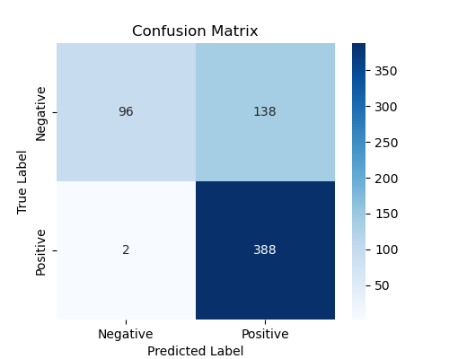
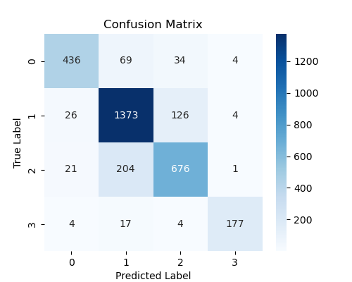

# Medical-Image-Classification

## Introduction

Pneumonia is a serious lung infection that causes over 50,000 deaths annually worldwide. X-ray imaging is a common method to diagnose pneumonia. Using machine learning to analyze these images can improve the accuracy and effectiveness of diagnoses, especially as a decision support system for medical professionals. This is crucial in resource-limited settings, such as developing countries or during pandemics, where it can help maintain the quality of medical services and enhance patient care. However, pneumonia is not the only lung disease which can be identified using xray image analysis. Training a model with a complex dataset including xray images of other disease conditions such as Covid-19 and lung infections can result in a more robust system to accurately distinguish pneumonia disease. Therefore, to observe and evaluate the performance I have used 2 datasets as described below. 

## DataSets

Dataset 1 : https://www.kaggle.com/datasets/paultimothymooney/chest-xraypneumonia

Dataset contains 5856 chest Xray images under two categories, pneumonia and healthy. There are 4273 X-ray images for pneumonia and 1583 healthy images. Images are in JPEG format and already divided into training, testing and validation. Due to very less number of data in validation dataset, a new validation set is created by splitting the training dataset.Data obtained from pediatric patients aged one to five years. 

Dataset 2 : https://www.kaggle.com/datasets/tawsifurrahman/covid19-radiographydatabase

Dataset contains 299*299-pixel chest Xray images in PNG format under four categories, covid-19, pneumonia, lung infection and healthy. There are 3615 Xray images for covid-19, 1345 for pneumonia, 6012 for lung infection and 10192 for healthy and total of 21164 X-ray images. 

## Model selection

In this work, I use a Convolutional Neural Network (CNN) and a pre-trained model, ResNet50. CNNs are a powerful deep learning approach that has shown excellent results in computer vision tasks, particularly in image classification. Our custom CNN model consists of 10 layers, including 3 convolutional layers, 3 pooling layers, 3 ReLU activation layers, and a fully connected layer. This custom CNN model was trained from scratch using the above datasets.

I also leverage ResNet50, a pre-trained CNN model, which has been trained on a large image dataset, ImageNet 1k. ResNet50 utilizes its previous learning to effectively identify patterns in the data. Only the classification head was fine-tuned while keeping the other layers intact to reduce computational cost. 

## Results and evalution

Four experiements has been conducted, two on each dataset using CNN model and ResNet50 model. Output files for both evaluation and test experiements are available in Results folder. 

### Pneumonia dataset

Test data information and results are as below.

- **Classes:** `{'NORMAL': 0, 'PNEUMONIA': 1}`
- **Test Data Size:** `624`

| Metric     | CNN    | ResNet50 |
|------------|--------|----------|
| Accuracy   | 0.7756 | 0.8542   |
| Recall     | 0.9949 | 0.9821   |
| Precision  | 0.7376 | 0.8201   |
| F1 Score   | 0.8472 | 0.8938   |

From the above results, it can be concluded that the fine-tuned ResNet50 model performs better than the custom CNN model, except for recall. Although the recall is high in CNN, its comparably lower precision is an issue because this can identify healthy people as unhealthy, leading to unnecessary treatments. This suggests that leveraging pretrained feature extraction from ResNet50 provides strong performance without excessive computational overhead, making it a practical and efficient option.

### Covid dataset

Test data information and results are as below.

- **Classes:** `{'Covid': 0, 'Healthy': 1, 'Lung_infection': 2, 'Pneumonia': 3}`
- **Test Data Size:** `3176`

| Metric     | CNN    | ResNet50 |
|------------|--------|----------|
| Accuracy   | 0.8317 | 0.8780   |
| Recall     | 0.8317 | 0.8780   |
| Precision  | 0.8693 | 0.8660   |
| F1 Score   | 0.8488 | 0.8716   |

For the multi-class classification scenario, ResNet50 demonstrates better performance over the CNN model, making it a more effective solution for the given problem. The confusion matrix further supports this, showing that ResNet50 achieves a higher number of true positives for pneumonia while significantly reducing misclassifications. This improvement is crucial for ensuring accurate diagnosis, minimizing false positives, and preventing unnecessary treatments. Therefore, ResNet50 emerges as the more reliable and efficient choice for pneumonia detection.

## Conclusion

While pneumonia can be identified through manual X-ray analysis, it can also be caused by conditions like COVID-19, making it difficult to identify the exact cause. Our results suggest that a two-stage system could be more effective: the first stage uses binary classification to achieve high recall and detect most cases of disease, while the second stage uses a multiclass classifier to confirm the diagnosis and guide patients to appropriate treatment. Using a pre-trained model in both stages enhances performance by leveraging prior learning for more accurate results.

## References

1. https://www.lung.org/lung-health-diseases/lung-disease-lookup/pneumonia/five-facts-you-should-know 
2. https://www.learnpytorch.io/ 

